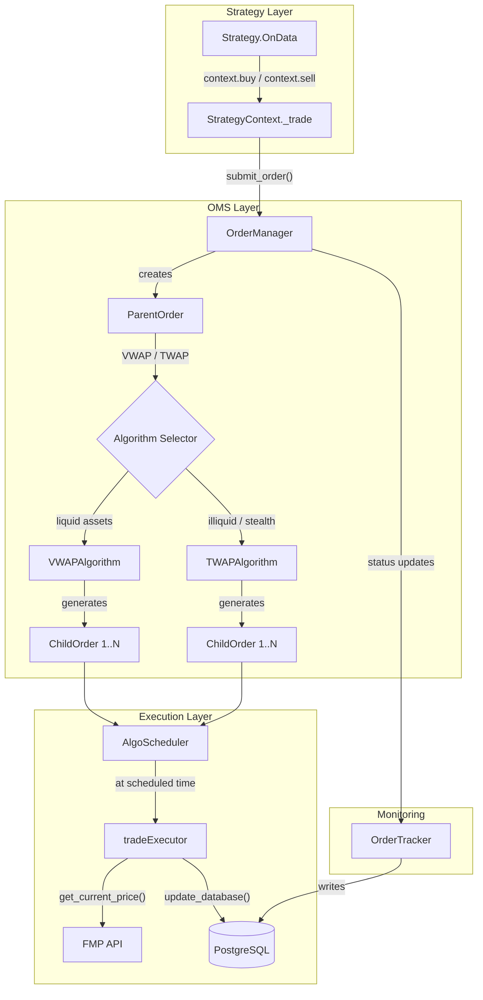
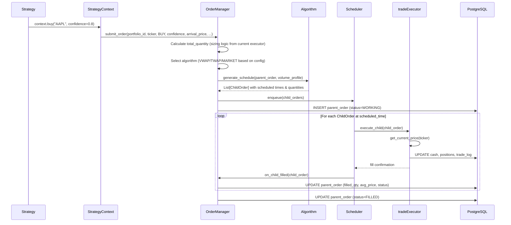
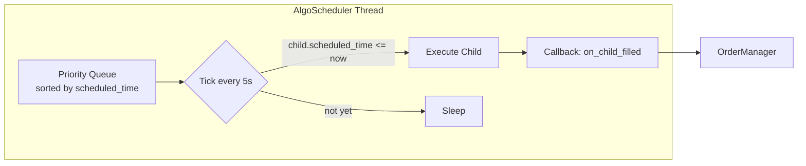
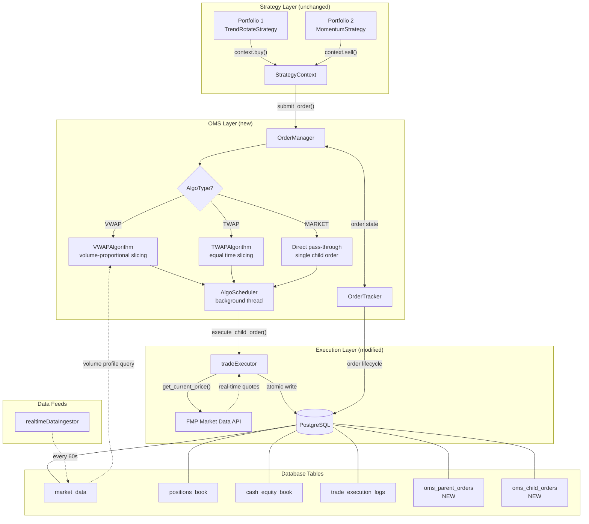

# Order Management System (OMS) — Design Document

## 1. Problem Statement

The current MQS trading system has a **fire-and-forget** execution model. When a strategy calls `context.buy("AAPL")`, the `tradeExecutor` immediately:
1. Calculates the full order size
2. Fetches a single market price from FMP
3. Executes the entire order as one atomic database write

There is no concept of an **order lifecycle**, no ability to slice a large order over time, and no execution algorithms. This means:
- Large orders move the market (high market impact)
- No benchmark to measure execution quality (VWAP, TWAP)
- No visibility into order state (pending, partially filled, complete, cancelled)
- No way to cancel or modify an in-flight order

The OMS introduces a layer between the strategy's intent ("buy AAPL with 80% confidence") and the actual market execution, enabling VWAP and TWAP algorithms to work child orders over time.

---

## 2. Current Architecture (Before OMS)

```
Strategy.OnData()
    │
    ├── context.buy(ticker, confidence)
    │       │
    │       └── StrategyContext._trade()
    │               │
    │               └── tradeExecutor.execute_trade()
    │                       │
    │                       ├── _calculate_buying_power()
    │                       ├── get_current_price(ticker)  ← single FMP API call
    │                       ├── Calculate quantity (floor(notional / price))
    │                       └── update_database()  ← atomic: cash + position + trade_log
    │
    └── (next ticker...)
```

The entire flow is synchronous and single-shot. One signal → one price fetch → one fill → done.

---

## 3. Proposed Architecture (With OMS)



---

## 4. File Structure

```
src/
├── oms/                              # NEW — Order Management System
│   ├── __init__.py
│   ├── models.py                     # Order, ChildOrder, OrderStatus, AlgoType enums/dataclasses
│   ├── order_manager.py              # OrderManager — central coordinator
│   ├── algorithms/
│   │   ├── __init__.py
│   │   ├── base.py                   # BaseAlgorithm ABC
│   │   ├── vwap.py                   # VWAPAlgorithm
│   │   └── twap.py                   # TWAPAlgorithm
│   ├── scheduler.py                  # AlgoScheduler — runs child orders on schedule
│   └── order_tracker.py              # OrderTracker — persists order lifecycle to DB
│
├── live_trading/
│   ├── executor.py                   # MODIFIED — receives child orders from scheduler
│   └── engine.py                     # MODIFIED — starts/stops OMS scheduler thread
│
├── portfolios/
│   └── strategy_api.py              # MODIFIED — StrategyContext routes through OMS
│
└── common/
    └── database/
        └── schemaDefinitions.py     # MODIFIED — new tables for orders
```

---

## 5. Component Design

### 5.1 `models.py` — Data Models

```python
from dataclasses import dataclass, field
from datetime import datetime
from enum import Enum
from typing import Optional
import uuid

class OrderStatus(Enum):
    PENDING = "PENDING"           # Created, not yet started
    WORKING = "WORKING"           # Algorithm is actively slicing
    PARTIALLY_FILLED = "PARTIAL"  # Some child orders filled
    FILLED = "FILLED"             # All child orders filled
    CANCELLED = "CANCELLED"       # User or system cancelled

class AlgoType(Enum):
    MARKET = "MARKET"   # Immediate execution (current behavior)
    VWAP = "VWAP"
    TWAP = "TWAP"

class Side(Enum):
    BUY = "BUY"
    SELL = "SELL"

@dataclass
class ParentOrder:
    order_id: str = field(default_factory=lambda: str(uuid.uuid4()))
    portfolio_id: str = ""
    ticker: str = ""
    side: Side = Side.BUY
    total_quantity: float = 0.0
    filled_quantity: float = 0.0
    algo_type: AlgoType = AlgoType.MARKET
    status: OrderStatus = OrderStatus.PENDING
    arrival_price: float = 0.0
    avg_fill_price: float = 0.0
    confidence: float = 1.0
    duration_minutes: int = 30        # How long the algo has to work the order
    created_at: datetime = field(default_factory=datetime.utcnow)
    updated_at: datetime = field(default_factory=datetime.utcnow)

    @property
    def remaining_quantity(self) -> float:
        return self.total_quantity - self.filled_quantity

    @property
    def is_complete(self) -> bool:
        return self.status in (OrderStatus.FILLED, OrderStatus.CANCELLED)

    @property
    def fill_pct(self) -> float:
        return self.filled_quantity / self.total_quantity if self.total_quantity > 0 else 0.0

@dataclass
class ChildOrder:
    child_id: str = field(default_factory=lambda: str(uuid.uuid4()))
    parent_order_id: str = ""
    ticker: str = ""
    side: Side = Side.BUY
    target_quantity: float = 0.0
    filled_quantity: float = 0.0
    scheduled_time: Optional[datetime] = None
    exec_price: float = 0.0
    status: OrderStatus = OrderStatus.PENDING
    slice_index: int = 0               # Which slice (0, 1, 2, ...)
```

### 5.2 `order_manager.py` — Central Coordinator

The `OrderManager` is the single entry point for the OMS. It replaces the direct call to `tradeExecutor.execute_trade()` from `StrategyContext`.



Key responsibilities:
- Receives order intent from `StrategyContext`
- Performs sizing (reuses existing margin/buying-power logic from `tradeExecutor`)
- Selects the execution algorithm based on portfolio config or per-order override
- Delegates schedule generation to the algorithm
- Hands child orders to the `AlgoScheduler`
- Tracks aggregate fill state and updates the parent order

### 5.3 `algorithms/base.py` — Algorithm Interface

```python
from abc import ABC, abstractmethod
from typing import List
from src.oms.models import ParentOrder, ChildOrder

class BaseAlgorithm(ABC):
    """All execution algorithms implement this interface."""

    @abstractmethod
    def generate_schedule(
        self,
        parent_order: ParentOrder,
        volume_profile: Optional[List[float]] = None,
    ) -> List[ChildOrder]:
        """
        Given a parent order, produce a list of child orders
        with target quantities and scheduled execution times.
        """
        ...
```

### 5.4 `algorithms/twap.py` — Time-Weighted Average Price

TWAP is the simpler algorithm. It divides the parent order into equal-sized slices executed at fixed intervals.

```
Parent Order: BUY 1000 shares AAPL over 30 minutes
TWAP with 10 slices → 100 shares every 3 minutes

Timeline:
|--100--|--100--|--100--|--100--|--100--|--100--|--100--|--100--|--100--|--100--|
t+0    t+3    t+6    t+9    t+12   t+15   t+18   t+21   t+24   t+27   t+30
```

Logic:
1. `num_slices = duration_minutes / interval_minutes`
2. `slice_qty = floor(total_quantity / num_slices)`
3. Remainder shares go into the last slice
4. Each child order gets `scheduled_time = start + (i * interval)`

No market data dependency. Pure clock-based execution.

### 5.5 `algorithms/vwap.py` — Volume-Weighted Average Price

VWAP sizes each child order proportionally to the expected volume in that time bucket.

```
Historical volume profile (normalized):
Bucket:  [9:30] [9:45] [10:00] [10:15] ... [15:45]
Weight:  [0.08] [0.06] [0.04]  [0.03]     [0.07]

Parent Order: BUY 1000 shares AAPL over 30 minutes starting at 10:00
Relevant buckets: [10:00, 10:15, 10:30, 10:45, 11:00, 11:15]
Weights (renorm): [0.04,  0.03,  0.03,  0.035, 0.04,  0.035] → [0.23, 0.17, 0.17, 0.20, 0.23, 0.20]

Child orders:
  10:00 → 190 shares (23% of 1000, rounded down, remainder to last)
  10:15 → 170 shares
  ...
```

Logic:
1. Query `market_data` table for historical intraday volume by 15-min bucket (configurable)
2. Build a normalized volume profile: `weight[i] = avg_volume[i] / sum(avg_volume)`
3. Filter to the time window of the parent order
4. Renormalize the filtered weights to sum to 1.0
5. `child_qty[i] = floor(total_quantity * weight[i])`
6. Remainder shares go into the highest-volume bucket

Volume profile query:
```sql
SELECT
    date_trunc('hour', timestamp) + 
        (EXTRACT(minute FROM timestamp)::int / 15) * INTERVAL '15 min' AS bucket,
    ticker,
    AVG(volume) AS avg_volume
FROM market_data
WHERE ticker = %s
  AND timestamp >= NOW() - INTERVAL '20 days'
  AND EXTRACT(dow FROM timestamp) BETWEEN 1 AND 5
GROUP BY bucket, ticker
ORDER BY bucket;
```

### 5.6 `scheduler.py` — Algo Scheduler

The scheduler is a background thread (one per `RunEngine` instance) that:
1. Maintains a priority queue of child orders sorted by `scheduled_time`
2. On each tick (every ~5 seconds), checks if any child orders are due
3. Calls `tradeExecutor.execute_child_order()` for due orders
4. Reports fills back to `OrderManager`



Key design decisions:
- Thread-safe queue (Python `queue.PriorityQueue` or `heapq` + `threading.Lock`)
- Graceful shutdown via `running` flag (mirrors `RunEngine.running`)
- Failed child orders are retried once, then marked CANCELLED
- The scheduler does NOT re-fetch prices or re-calculate sizing — that's the executor's job

### 5.7 `order_tracker.py` — Persistence

Writes order lifecycle events to two new database tables (see Section 6). Provides query methods for:
- Active orders for a portfolio
- Order history with fill details
- Execution quality metrics (avg fill vs arrival price, vs VWAP benchmark)

### 5.8 Modifications to Existing Files

#### `strategy_api.py` — StrategyContext._trade()

Current:
```python
def _trade(self, ticker, signal_type, confidence):
    self._executor.execute_trade(...)
```

Proposed:
```python
def _trade(self, ticker, signal_type, confidence):
    if self._order_manager is not None:
        self._order_manager.submit_order(
            portfolio_id=self._portfolio_config['id'],
            ticker=ticker,
            side=signal_type,
            confidence=confidence,
            arrival_price=asset_data.Close,
            cash=self.Portfolio.cash,
            positions=self._positions_df,
            port_notional=self.Portfolio.total_value,
            ticker_weight=self.Portfolio.get_asset_weight(ticker, asset_data.Close),
            timestamp=self.time,
        )
    else:
        # Fallback: direct execution (backward compatible, used in backtest)
        self._executor.execute_trade(...)
```

The `StrategyContext.__init__` receives an optional `order_manager` parameter. When running live with OMS enabled, the engine passes it in. Backtests continue to use the direct executor path — no changes needed to `BacktestExecutor`.

#### `live_trading/engine.py` — RunEngine

- `__init__`: Creates `OrderManager` and `AlgoScheduler` instances
- `run()`: Starts the scheduler thread alongside portfolio threads
- Shutdown: Stops scheduler, waits for in-flight orders to complete or cancel

#### `live_trading/executor.py` — tradeExecutor

Add a new method `execute_child_order(child_order: ChildOrder)` that:
1. Fetches current price via `get_current_price()`
2. Executes the child order's `target_quantity` (no re-sizing)
3. Calls `update_database()` with the child's quantity
4. Returns the fill details (exec_price, filled_qty, slippage_bps)

The existing `execute_trade()` method remains unchanged for backward compatibility.

---

## 6. Database Schema Additions

```sql
-- Parent orders table
CREATE TABLE IF NOT EXISTS oms_parent_orders (
    order_id VARCHAR(36) PRIMARY KEY,
    portfolio_id VARCHAR(50) NOT NULL,
    ticker VARCHAR(10) NOT NULL,
    side VARCHAR(4) NOT NULL,
    algo_type VARCHAR(10) NOT NULL,
    total_quantity NUMERIC NOT NULL,
    filled_quantity NUMERIC DEFAULT 0,
    arrival_price NUMERIC NOT NULL,
    avg_fill_price NUMERIC DEFAULT 0,
    confidence NUMERIC,
    duration_minutes INT,
    status VARCHAR(20) NOT NULL DEFAULT 'PENDING',
    created_at TIMESTAMP WITH TIME ZONE DEFAULT NOW(),
    updated_at TIMESTAMP WITH TIME ZONE DEFAULT NOW()
);

-- Child orders table
CREATE TABLE IF NOT EXISTS oms_child_orders (
    child_id VARCHAR(36) PRIMARY KEY,
    parent_order_id VARCHAR(36) NOT NULL REFERENCES oms_parent_orders(order_id),
    ticker VARCHAR(10) NOT NULL,
    side VARCHAR(4) NOT NULL,
    target_quantity NUMERIC NOT NULL,
    filled_quantity NUMERIC DEFAULT 0,
    scheduled_time TIMESTAMP WITH TIME ZONE,
    exec_price NUMERIC DEFAULT 0,
    slippage_bps NUMERIC DEFAULT 0,
    slice_index INT,
    status VARCHAR(20) NOT NULL DEFAULT 'PENDING',
    created_at TIMESTAMP WITH TIME ZONE DEFAULT NOW(),
    executed_at TIMESTAMP WITH TIME ZONE
);

CREATE INDEX idx_parent_orders_portfolio ON oms_parent_orders(portfolio_id, status);
CREATE INDEX idx_child_orders_parent ON oms_child_orders(parent_order_id);
CREATE INDEX idx_child_orders_scheduled ON oms_child_orders(scheduled_time, status);
```

---

## 7. Full Interaction Diagram



---

## 8. Configuration

Each portfolio's `config.json` gets an optional `OMS` section:

```json
{
    "PORTFOLIO_ID": "4",
    "TICKERS": ["AAPL", "MSFT", "GOOGL", "NVDA"],
    "OMS": {
        "enabled": true,
        "default_algo": "VWAP",
        "duration_minutes": 30,
        "twap_num_slices": 10,
        "vwap_bucket_minutes": 15,
        "vwap_lookback_days": 20,
        "min_order_notional": 100.0,
        "fallback_to_market": true
    }
}
```

When `OMS.enabled` is `false` or the section is missing, the system falls back to the current direct-execution behavior. This makes the OMS fully opt-in and backward compatible.

---

## 9. VWAP vs TWAP — When to Use Which

| Criteria | VWAP | TWAP |
|---|---|---|
| Asset liquidity | High (AAPL, MSFT, SPY) | Low or erratic volume |
| Goal | Match market benchmark | Minimize detection / stealth |
| Volume data needed | Yes (historical intraday) | No |
| Adapts to market | Yes (heavier in high-volume periods) | No (fixed intervals) |
| Implementation complexity | Higher | Lower |
| Risk of poor fills | Low in liquid markets | Higher in quiet periods |
| Front-running risk | Moderate (predictable pattern) | Low (clockwork is harder to detect) |

The `OrderManager` can auto-select based on a simple heuristic:
- If average daily volume > threshold → VWAP
- Otherwise → TWAP
- Override available per-order via `algo_type` parameter

---

## 10. Implementation Order

1. `src/oms/models.py` — Data models (no dependencies)
2. `src/oms/algorithms/base.py` — Algorithm ABC
3. `src/oms/algorithms/twap.py` — TWAP (simpler, no DB dependency)
4. `src/oms/algorithms/vwap.py` — VWAP (needs volume profile query)
5. `src/oms/order_tracker.py` — DB persistence + schema migration
6. `src/oms/scheduler.py` — Background execution thread
7. `src/oms/order_manager.py` — Coordinator (ties everything together)
8. Modify `src/live_trading/executor.py` — Add `execute_child_order()`
9. Modify `src/live_trading/engine.py` — Wire up OMS lifecycle
10. Modify `src/portfolios/strategy_api.py` — Route through OMS
11. Update `src/common/database/schemaDefinitions.py` — New tables
