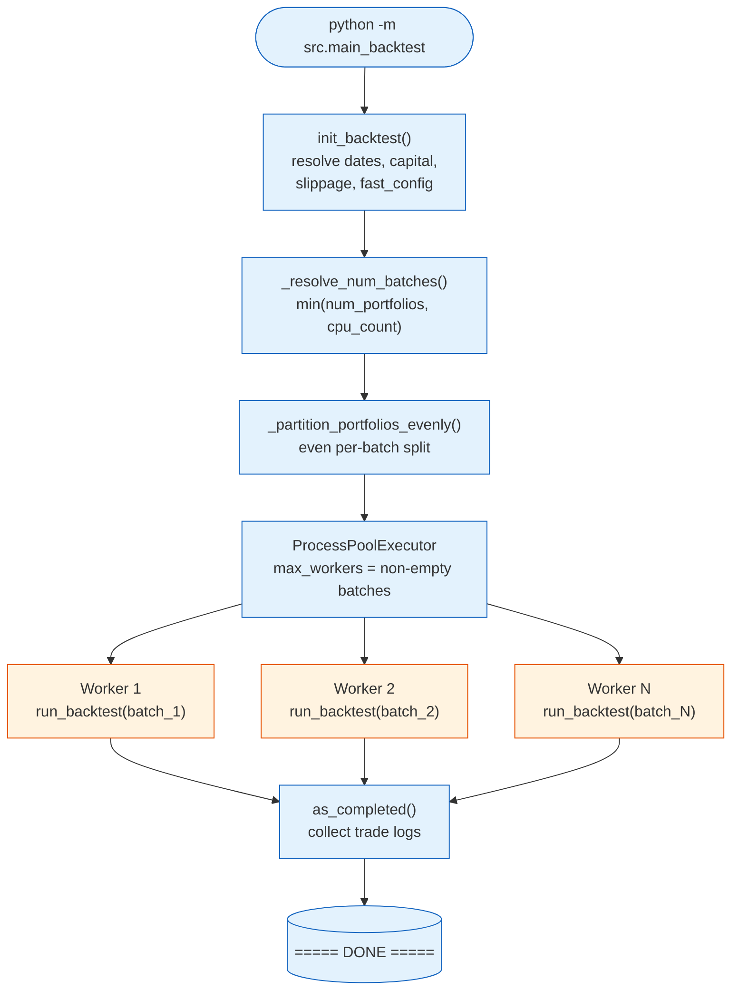
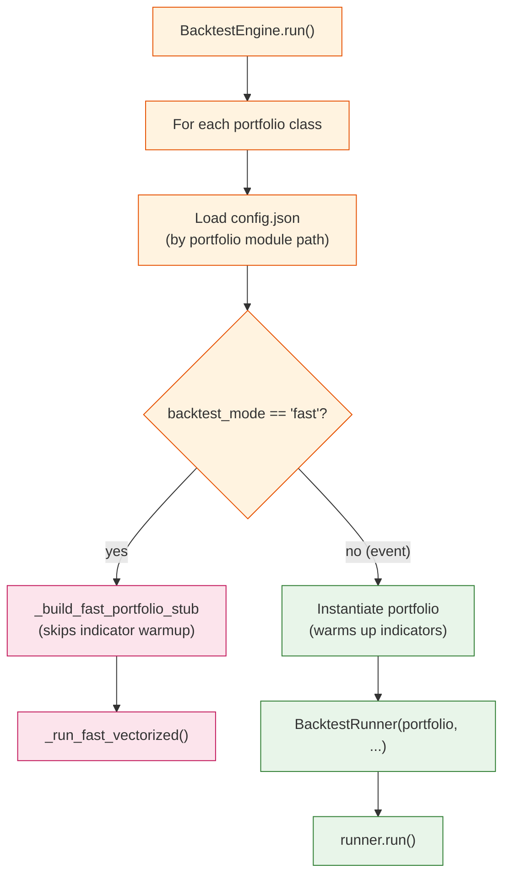
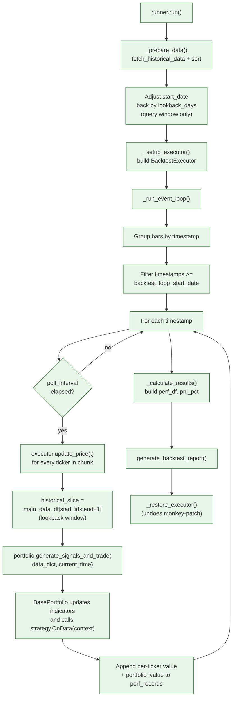
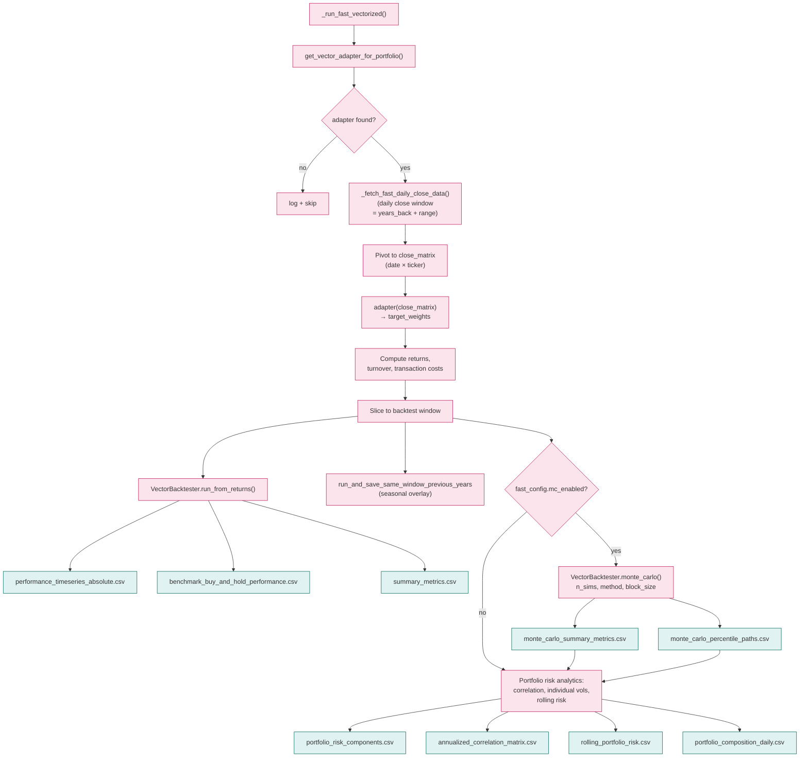

# Backtest Flow

End-to-end flow of `python -m src.main_backtest`, from process launch through report generation. The entry point fans portfolios out across worker processes, and each worker drives one of two execution modes.

## Top-level Driver



Each worker process pins its `tqdm` row via `TQDM_POSITION` so progress bars don't collide on the terminal. A worker constructs its own `MQSDBConnector` and `BacktestEngine` — connections and engines are not shared across processes.

## Engine Dispatch (per worker)



Mode is selected by `BACKTEST_MODE` in `main_backtest.py`. `"event"` is the default and full-fidelity simulation; `"fast"` swaps in a vectorized path with optional Monte Carlo overlay.

## Event Mode (`BacktestRunner`)



Notable invariants:
- The lookback adjustment only widens the *query* window. The simulation loop still starts at the requested `start_date`.
- `BacktestExecutor` is monkey-patched onto the portfolio (replacing whatever live executor was passed) and restored in `finally`.
- Strategies see `data_dict["MARKET_DATA"]` as a sliced DataFrame containing only the lookback window up to and including the current bar.

## Fast Mode (`VectorBacktester`)



Fast mode bypasses indicator warmup and the event loop entirely. It instantiates a lightweight portfolio stub via `_build_fast_portfolio_stub()` (no `OnData` execution), pulls daily closes for an extended window, and lets the registered vector adapter produce target weights directly. Indicators in adapter modules (e.g. `_compute_rsi`, `_compute_rmi` in `vector_strategy_adapters.py`) are vectorized re-implementations — they do not import the event-mode indicator classes.

## Configuration Reference

```python
# src/main_backtest.py
START_DATE = "2025-01-01"
END_DATE = "2025-01-05"
INITIAL_CAPITAL = 1_000_000.0
SLIPPAGE = 0.000001              # 0.1 bp
BACKTEST_MODE = ""               # "" → defaults to "event" with FutureWarning; "fast" enables vectorized
BACKTEST_NUM_BATCHES = None      # None → min(num_portfolios, cpu_count)

FAST_MODE_CONFIG = {
    "years_back": 3,
    "benchmark_label": "SPY",
    "quick": True,
    "mc_enabled": True,
    "mc_n_sims": 10000,
    "mc_method": "bootstrap",
    "mc_block_size": 5,
    "mc_seed": None,
    "mc_plot_percentiles": [10, 50, 90],
}
```

| Knob | Purpose |
|------|---------|
| `START_DATE` / `END_DATE` | Backtest window (NY-zoned dates) |
| `INITIAL_CAPITAL` | Per-portfolio starting capital |
| `SLIPPAGE` | Per-trade slippage applied by `BacktestExecutor` and fast-mode turnover cost |
| `BACKTEST_MODE` | `"event"` for full simulation, `"fast"` for vectorized + MC |
| `BACKTEST_NUM_BATCHES` | Override worker count; `None` auto-selects |
| `fast_config.mc_*` | Monte Carlo controls (only used in fast mode) |
| `years_back` | How far back fast mode pulls daily history before the start date |

## Output Files

Each backtest run writes to a timestamped directory under `src/backtest/data/<run_ts>_backtest_<portfolio_id>/` (or the directory pointed to by `BACKTEST_OUTPUT_DIR`).

### Event mode

| File | Description |
|------|-------------|
| `trade_log.csv` | Every executed trade (timestamp, side, qty, prices, slippage) |
| `performance_timeseries_absolute.csv` | Portfolio value over time |
| `performance_timeseries_percentage.csv` | Returns as percentages |
| `performance_timeseries_minute_by_minute.csv` | High-frequency series |
| `summary_metrics.csv` | Final value, max drawdown, Sharpe, etc. |
| `benchmark_buy_and_hold_performance.csv` | Buy-and-hold reference |
| `30D_Rolling.csv` / `90D_Rolling.csv` / `180D_Rolling.csv` | Rolling stats |
| `monthly_returns.csv` | Resampled monthly returns |
| `portfolio_risk_components.csv` | Per-asset volatility |
| `annualized_correlation_matrix.csv` | Asset correlation matrix |
| `rolling_portfolio_risk.csv` | Rolling portfolio volatility |

### Fast mode

| File | Description |
|------|-------------|
| `performance_timeseries_absolute.csv` | Strategy P&L over the window |
| `benchmark_buy_and_hold_performance.csv` | Equal-weighted benchmark of the same tickers |
| `summary_metrics.csv` | Vectorized run metrics |
| `monte_carlo_summary_metrics.csv` | Aggregate stats across simulated paths (when `mc_enabled`) |
| `monte_carlo_percentile_paths.csv` | Per-percentile cumulative-return paths |
| `portfolio_risk_components.csv` | Final-weights × annualized vol |
| `annualized_correlation_matrix.csv` | Returns correlation across portfolio tickers |
| `rolling_portfolio_risk.csv` | Rolling weighted volatility |
| `portfolio_composition_daily.csv` | Daily allocation × portfolio value (approximation) |
| Seasonal overlay files | Same-window comparison for previous N years (`years_back`) |

## Adding a New Strategy to the Backtest

1. Create `src/portfolios/portfolio_<n>/strategy.py` with a `BasePortfolio` subclass.
2. Add `src/portfolios/portfolio_<n>/config.json` with at least `PORTFOLIO_ID`, `TICKERS`, `INTERVAL`, `LOOKBACK_DAYS`.
3. Import and register the class in `AVAILABLE_PORTFOLIO_CLASSES` (and optionally `DEFAULT_PORTFOLIO_CLASSES`) in `src/main_backtest.py`.
4. (Optional) Register a fast-mode adapter in `src/backtest/vector_strategy_adapters.py` if you want the strategy to participate in fast mode. Without an adapter, fast mode logs a warning and skips that portfolio.
