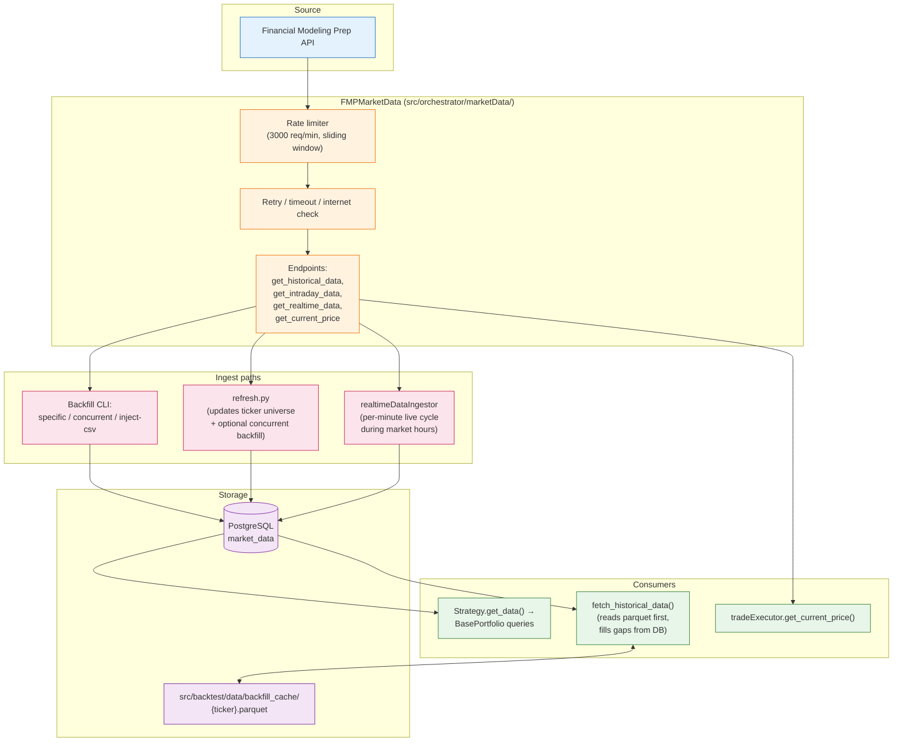
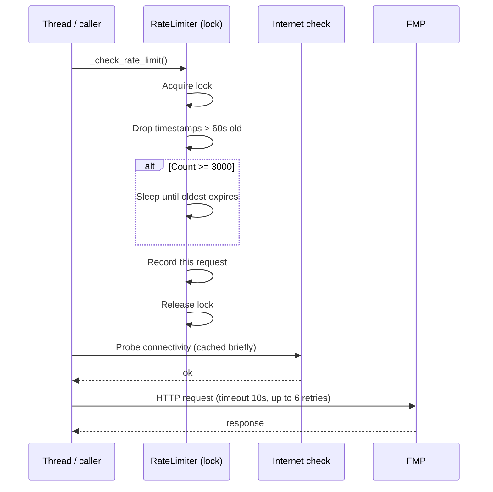
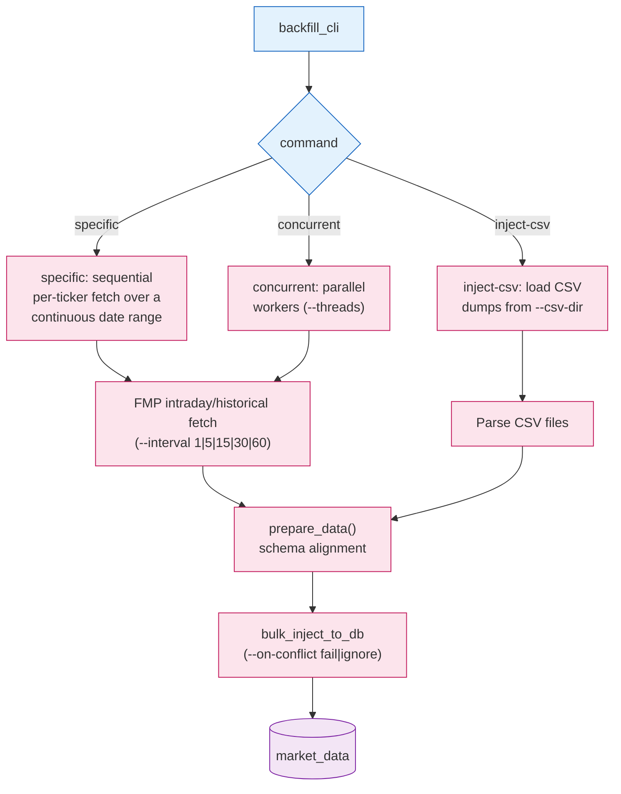
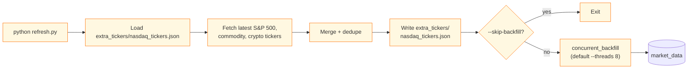
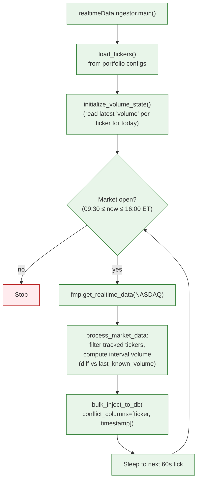
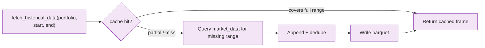

# Data Pipeline

Three flows feed the `market_data` table:

1. **Backfill** — bulk historical ingest from FMP, driven by the `backfill_cli`.
2. **Real-time ingestor** — minute-resolution scrape during market hours.
3. **Strategy reads** — backtests warm a per-ticker parquet cache to skip repeated DB hits.

Plus an out-of-band ticker-universe refresh (`refresh.py`) that updates the seed list and optionally kicks off a backfill.

## High-level Flow

## FMPMarketData Client

A single `FMPMarketData` instance is shared across threads in a process; rate limiting and retries are thread-safe.

Key methods: `get_historical_data`, `get_intraday_data`, `get_realtime_data` (batch exchange quote), `get_current_price`.

## Backfill CLI

Entrypoint: `python -m src.orchestrator.backfill.backfill_cli <command>`.

| Argument | Default | Notes |
|----------|---------|-------|
| `--start DDMMYY` / `--end DDMMYY` | — | Inclusive range |
| `--tickers T1 T2 ...` | falls back to `tickers.json` | Sibling of `backfill_cli.py` |
| `--exchange` | `NASDAQ` | |
| `--interval` | `1` | Minutes; one of `1, 5, 15, 30, 60` |
| `--threads` (concurrent / inject-csv) | `6` / `5` | Keep under DB pool size |
| `--on-conflict` | `fail` | `ignore` appends `ON CONFLICT DO NOTHING` |
| `--dry-run` | off | Fetch + parse, skip DB writes |

Full command reference: [../BackFill/Readme.md](../BackFill/Readme.md).

## Ticker Refresh + Universe Update

`src/orchestrator/backfill/update/refresh.py` keeps the seed ticker list in sync with current S&P 500 / commodity / crypto coverage:

CLI reference: [../BackFill/refresh_README.md](../BackFill/refresh_README.md).

## Real-time Ingestor

The ingestor stores *interval* volume (delta vs previously seen cumulative volume), not the cumulative API value. There is a known fragility: a crash mid-day re-initializes volume state from the stored interval volume, which is incorrect — see the warning comment at the top of `realtimeDataIngestor.py`.

## Backfill Cache (parquet)

The backtest path warms a per-ticker parquet file under `src/backtest/data/backfill_cache/{ticker}.parquet`. This is purely a *read* cache: it speeds up repeat backtests over overlapping date ranges by avoiding the DB round trip for the bars already on disk.

The cache directory is committed (the `.parquet` files act as a checked-in dataset for tests). Delete a ticker's parquet to force a fresh DB pull for that symbol.

## `market_data` Schema (subset)

| Column | Type | Notes |
|--------|------|-------|
| `id` | `SERIAL PK` | |
| `ticker` | `VARCHAR(10)` | |
| `timestamp` | `TIMESTAMP WITH TIME ZONE` | UTC stored, NY for query convenience |
| `date` | `DATE` | Denormalized for daily-window filters |
| `exchange` | `VARCHAR(50)` | |
| `open_price` / `high_price` / `low_price` / `close_price` | `NUMERIC` | |
| `volume` | `BIGINT` | Real-time ingestor stores *interval* volume |
| `avg_sentiment` | `NUMERIC` | Optional sentiment overlay (NLP pipeline) |
| `created_at` | `TIMESTAMP DEFAULT NOW()` | |

Unique constraint: `(ticker, timestamp)` — required for `--on-conflict ignore` semantics.
