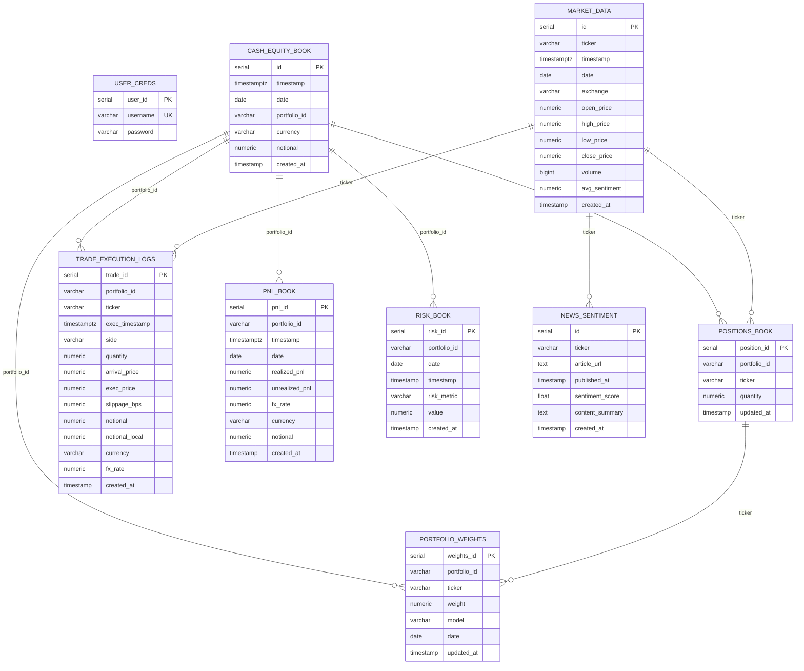
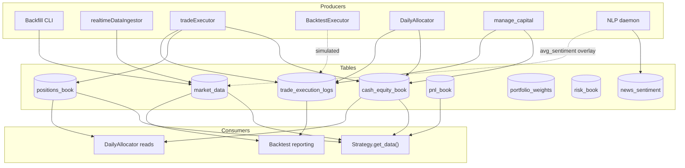
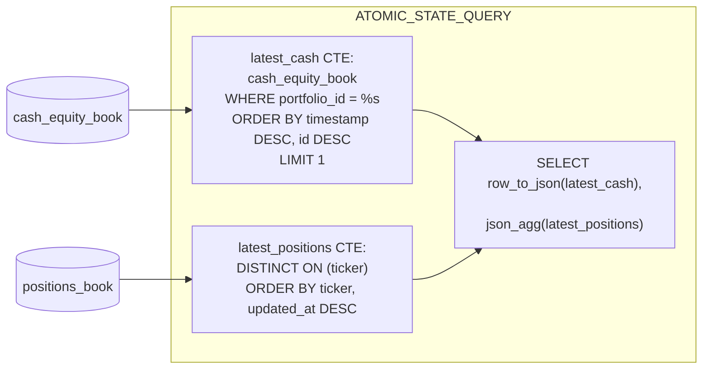
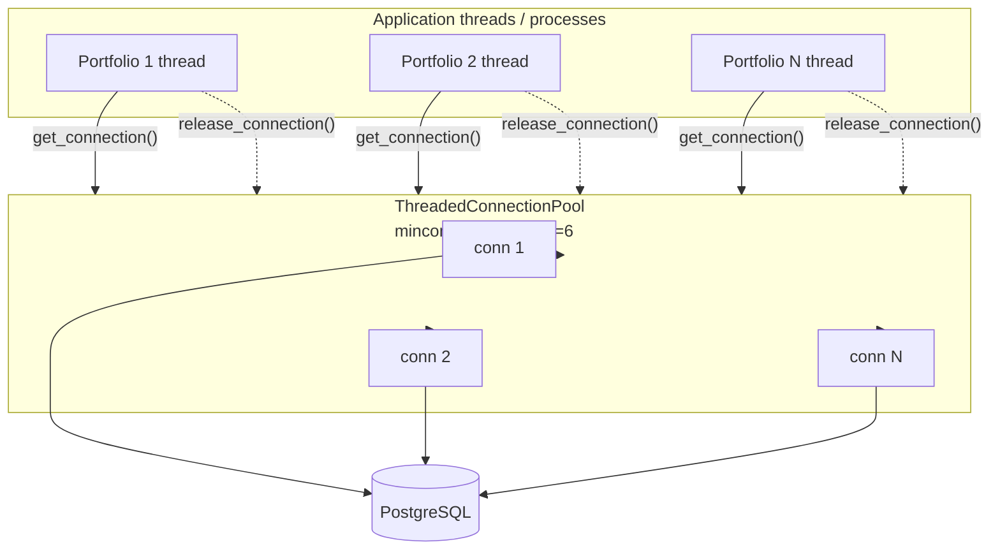

# Database Schema

PostgreSQL schema as defined in `src/common/database/schemaDefinitions.py`. Tables are created idempotently by `python -m src.common.database.create_all_tables`.

## Tables



Constraints worth highlighting:
- `positions_book` has `UNIQUE (portfolio_id, ticker)` — at most one row per portfolio × ticker.
- `portfolio_weights` has `UNIQUE (portfolio_id, ticker, date, model)` — one weight per portfolio × ticker × day × model.
- `market_data` should have a unique index on `(ticker, timestamp)` so the backfill CLI's `--on-conflict ignore` mode works as intended.

## Read / Write Paths



`portfolio_weights`, `risk_book`, and `news_sentiment` are produced by research/operational paths but are not yet read by the live trading or backtest engine — they exist for reporting and future strategy use.

## Atomic State Query

`BasePortfolio.get_data()` issues a single CTE-based query so that cash and positions are read in one consistent snapshot, instead of two queries that could straddle a write:



The single statement returns both halves of the snapshot, eliminating the read-skew window.

## Connection Pool

`MQSDBConnector` wraps `psycopg2.pool.ThreadedConnectionPool`. Threads (live trading) and processes (backtest) acquire and release connections through the same API:



When tuning concurrency (live thread count, backfill `--threads`, multiprocess backtest workers), keep the working set under `maxconn` to avoid acquisition stalls.

## Auto-seeding

When a portfolio runs for the first time and has no `cash_equity_book` row, `BasePortfolio._seed_initial_cash()` inserts a starter row of `DEFAULT_INITIAL_CAPITAL` (currently `1,000,000` USD). Similarly, missing tickers in `positions_book` are seeded at `quantity = 0`. Both paths log a warning so the first-run behavior is auditable.

## Common Queries

```sql
-- Latest cash balance for a portfolio
SELECT notional FROM cash_equity_book
WHERE portfolio_id = %s
ORDER BY timestamp DESC, id DESC
LIMIT 1;

-- Latest position per ticker for a portfolio
SELECT DISTINCT ON (ticker)
    position_id, portfolio_id, ticker, quantity, updated_at
FROM positions_book
WHERE portfolio_id = %s
ORDER BY ticker, updated_at DESC;

-- Market-data window for a ticker basket
SELECT *
FROM market_data
WHERE ticker IN ({placeholders})
  AND timestamp BETWEEN %s AND %s;

-- Idempotent bulk insert
INSERT INTO {table} ({columns}) VALUES %s
ON CONFLICT ({conflict_columns}) DO NOTHING;
```
