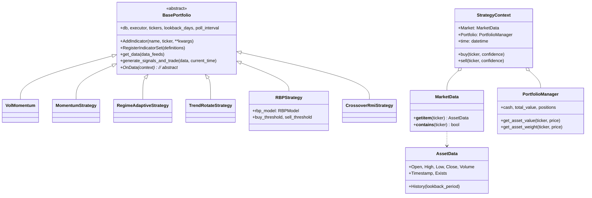
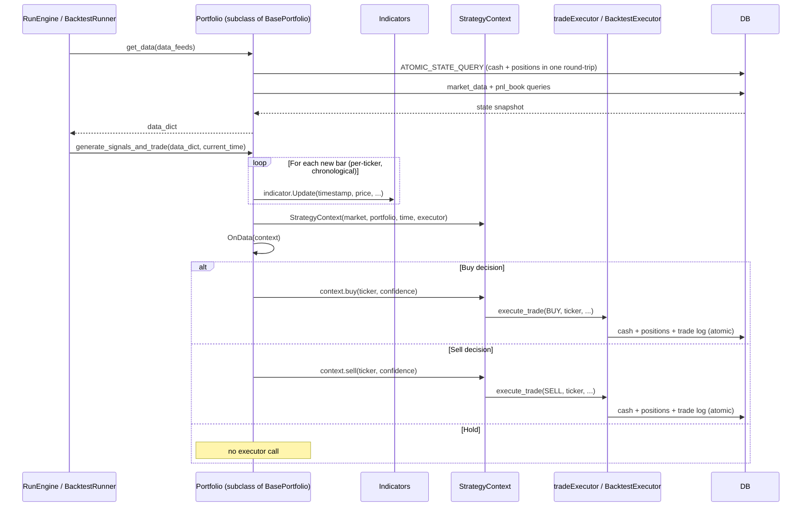
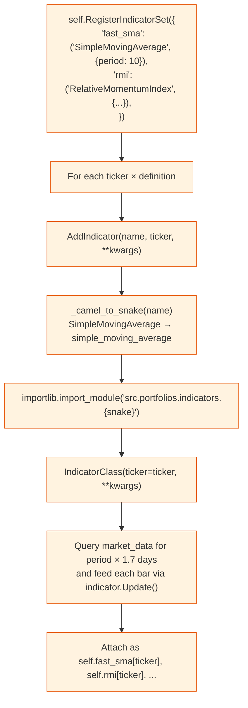
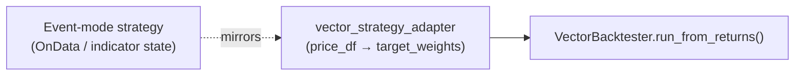

# Portfolio / Strategy Flow

How a strategy goes from "I think AAPL should be bought" to a database write, and how indicators stay warm while it does.

## Class Hierarchy



## Strategy Lifecycle (event mode)



`generate_signals_and_trade()` always tracks `_last_processed_timestamp`; only bars strictly newer than that are fed to indicators. This makes the path correct for both live polling (where `current_time=None` so the latest bar is used) and backtest replay (where `current_time` is the simulated clock).

## Indicator Factory



Adding a new indicator only requires a file under `src/portfolios/indicators/` whose snake_case name matches its CamelCase class name. Strategies can then register it through `RegisterIndicatorSet`.

### Available Indicators

| File | Class | Notes |
|------|-------|-------|
| `simple_moving_average.py` | `SimpleMovingAverage` | Plain SMA over `period` bars |
| `exponential_moving_average.py` | `ExponentialMovingAverage` | EMA with configurable smoothing |
| `displaced_moving_average.py` | `DisplacedMovingAverage` | SMA shifted forward by `displacement` |
| `relative_strength_index.py` | `RelativeStrengthIndex` | Wilder's RSI |
| `relative_momentum_index.py` | `RelativeMomentumIndex` | RSI generalized over `momentum_period` |
| `average_true_range.py` | `AverageTrueRange` | Reads `high_col` / `low_col` / `close_col` |
| `rate_of_change.py` | `RateOfChange` | Percent change over `period` |
| `vwap.py` | `VWAP` | Reads `vol_col` (typically `volume`) |

## Strategy Roster

| ID | Class | Indicators / signals | Trade rule |
|----|-------|---------------------|------------|
| 1 | `VolMomentum` | Volatility-aware momentum signal | Enter on ranked momentum, exit on regime flip |
| 2 | `MomentumStrategy` | Multi-period momentum | Long basket reweighted by momentum score |
| 3 | `RegimeAdaptiveStrategy` | Regime detector + momentum | Switch behavior based on detected regime |
| 4 | `TrendRotateStrategy` | Trend rank + rotation | Hold top-N by trend score |
| 5 | `RBPStrategy` | `RBPModel` (Relevance-Based Prediction) over engineered return / vol features | Buy on `prediction > buy_threshold`, sell on `prediction < sell_threshold` once a position exists |
| dummy | `CrossoverRmiStrategy` | SMA(20) / SMA(50) crossover + RMI(14) + winsorized vol stop | Showcase of `Portfolio` risk-off, `History`, `toolkit.winsorize`, and stop-loss logic |

## Sizing Model (live executor, in `tradeExecutor.execute_trade`)

```text
target_notional = port_notional × ticker_weight
adjustment      = target_notional - current_asset_notional
trade_notional  = adjustment × confidence
trade_qty       = floor(trade_notional / arrival_price)
```

The same shape is used in `BacktestExecutor`, with simulated cash/position bookkeeping and slippage applied to `arrival_price`.

## Fast Mode: Vector Adapters

Event-mode strategies are stateful (one bar at a time). Fast mode needs a vectorized signal across the entire window, so each strategy that opts into fast mode has a sibling adapter in `src/backtest/vector_strategy_adapters.py`:



Adapters re-implement the relevant indicator math in pandas/numpy (`_compute_rsi`, `_compute_rmi`, etc.) so fast mode can produce a `target_weights` matrix without ever instantiating the live indicator classes. Strategies without a registered adapter simply skip fast mode with a warning — see `get_vector_adapter_for_portfolio()`.

## Indicator Registration Example

```python
# In strategy __init__:
self.RegisterIndicatorSet({
    "fast_sma": ("SimpleMovingAverage", {"period": 10}),
    "slow_sma": ("SimpleMovingAverage", {"period": 30}),
    "rsi":      ("RelativeStrengthIndex", {"period": 14}),
})

def OnData(self, context):
    for ticker in self.tickers:
        fast = self.fast_sma[ticker].Current
        slow = self.slow_sma[ticker].Current
        rsi  = self.rsi[ticker].Current
        if fast > slow and rsi < 70:
            context.buy(ticker, confidence=0.8)
```
