# System Architecture

High-level view of the MQS Trading System's runtime components and how they connect.

## Component Map

```mermaid
flowchart TB
    subgraph Entry["Entry Points"]
        MAIN["src/main.py<br/>(live trading)"]
        BACKTEST["src/main_backtest.py<br/>(multiprocess driver)"]
        ALLOCATOR_CLI["src/risk_manager/daily_allocator.py"]
        CAPITAL_CLI["src/risk_manager/manage_capital.py"]
        REALTIME_CLI["src/orchestrator/realTime/<br/>realtimeDataIngestor.py"]
        NLP_CLI["NLP/main_NLP.py"]
        BACKFILL_CLI["src/orchestrator/backfill/backfill_cli.py"]
    end

    subgraph Engines["Core Engines"]
        RUN_ENGINE["RunEngine<br/>(thread per portfolio)"]
        BT_ENGINE["BacktestEngine<br/>(per-portfolio dispatch)"]
        BT_RUNNER["BacktestRunner<br/>(event-mode loop)"]
        VEC_BT["VectorBacktester<br/>(fast-mode)"]
    end

    subgraph Execution["Execution"]
        LIVE_EXEC["tradeExecutor<br/>(real fills via FMP + DB)"]
        BT_EXEC["BacktestExecutor<br/>(simulated fills + margin)"]
    end

    subgraph Strategies["Portfolio Strategies"]
        BASE["BasePortfolio<br/>(abstract)"]
        P1["Portfolio 1: VolMomentum"]
        P2["Portfolio 2: MomentumStrategy"]
        P3["Portfolio 3: RegimeAdaptiveStrategy"]
        P4["Portfolio 4: TrendRotateStrategy"]
        P5["Portfolio 5: RBPStrategy"]
        PD["Portfolio dummy: CrossoverRmiStrategy"]
        ADAPTERS["vector_strategy_adapters<br/>(fast-mode shadow signals)"]
    end

    subgraph API["Strategy API"]
        CTX["StrategyContext"]
        MARKET["MarketData"]
        PORT["PortfolioManager"]
        IND["Indicator System<br/>(SMA/EMA/RSI/RMI/ATR/DMA/ROC/VWAP)"]
    end

    subgraph Data["Data Layer"]
        DB[("MQSDBConnector<br/>PostgreSQL pool")]
        FMP["FMPMarketData"]
        BACKFILL["Backfill service<br/>+ parquet cache"]
        REALTIME["realtimeDataIngestor"]
    end

    subgraph Risk["Risk + Capital"]
        ALLOC["DailyAllocator"]
        CAP["manage_capital"]
    end

    subgraph Research["Research / Signals"]
        NLP["NLP pipeline<br/>FinBERT scoring"]
        RBP_MODEL["RBPModel<br/>(Relevance-Based Prediction)"]
    end

    subgraph Reports["Reporting"]
        REPORT["BacktestReporting<br/>(trade log, metrics, risk, MC)"]
    end

    %% Entry → engines / scripts
    MAIN --> RUN_ENGINE
    BACKTEST --> BT_ENGINE
    BT_ENGINE --> BT_RUNNER
    BT_ENGINE --> VEC_BT
    ALLOCATOR_CLI --> ALLOC
    CAPITAL_CLI --> CAP
    REALTIME_CLI --> REALTIME
    BACKFILL_CLI --> BACKFILL

    %% Engines → execution
    RUN_ENGINE --> LIVE_EXEC
    BT_RUNNER --> BT_EXEC

    %% Strategies inherit / fast-mode shadow
    BASE --> P1
    BASE --> P2
    BASE --> P3
    BASE --> P4
    BASE --> P5
    BASE --> PD
    P1 -.-> ADAPTERS
    P2 -.-> ADAPTERS
    P3 -.-> ADAPTERS
    P4 -.-> ADAPTERS
    PD -.-> ADAPTERS
    ADAPTERS --> VEC_BT

    %% Engines load strategies
    RUN_ENGINE --> BASE
    BT_RUNNER --> BASE
    VEC_BT -.-> BASE

    %% Strategy API surfaces
    BASE --> CTX
    CTX --> MARKET
    CTX --> PORT
    BASE --> IND

    %% Data
    DB --> RUN_ENGINE
    DB --> BT_ENGINE
    DB --> LIVE_EXEC
    DB --> ALLOC
    DB --> CAP
    FMP --> LIVE_EXEC
    FMP --> BACKFILL
    FMP --> REALTIME
    BACKFILL --> DB
    REALTIME --> DB

    %% Research feeds
    NLP --> DB
    RBP_MODEL --> P5

    %% Reporting
    BT_RUNNER --> REPORT
    VEC_BT --> REPORT

    classDef entry fill:#e1f5fe,stroke:#01579b
    classDef engine fill:#fff3e0,stroke:#e65100
    classDef exec fill:#fce4ec,stroke:#880e4f
    classDef strat fill:#e8f5e9,stroke:#1b5e20
    classDef data fill:#f3e5f5,stroke:#4a148c
    classDef risk fill:#fff8e1,stroke:#ff6f00
    classDef api fill:#e0f2f1,stroke:#004d40
    classDef research fill:#ede7f6,stroke:#311b92
    classDef report fill:#efebe9,stroke:#3e2723

    class MAIN,BACKTEST,ALLOCATOR_CLI,CAPITAL_CLI,REALTIME_CLI,NLP_CLI,BACKFILL_CLI entry
    class RUN_ENGINE,BT_ENGINE,BT_RUNNER,VEC_BT engine
    class LIVE_EXEC,BT_EXEC exec
    class BASE,P1,P2,P3,P4,P5,PD,ADAPTERS strat
    class DB,FMP,BACKFILL,REALTIME data
    class ALLOC,CAP risk
    class CTX,MARKET,PORT,IND api
    class NLP,RBP_MODEL research
    class REPORT report
```

## Component Reference

| Component | Location | Role |
|-----------|----------|------|
| `RunEngine` | `src/live_trading/engine.py` | Concurrent live execution; one thread per portfolio with circuit breaker |
| `tradeExecutor` | `src/live_trading/executor.py` | Real-time order execution + atomic DB writes |
| `BacktestEngine` | `src/backtest/backtest_engine.py` | Per-portfolio dispatch into event or fast mode |
| `BacktestRunner` | `src/backtest/runner.py` | Event-driven simulation loop |
| `VectorBacktester` | `src/backtest/vectorized_backtest.py` | Vectorized fast-mode execution + Monte Carlo |
| `vector_strategy_adapters` | `src/backtest/vector_strategy_adapters.py` | Fast-mode signal shadows for each event-mode strategy |
| `BacktestExecutor` | `src/backtest/executor.py` | Simulated trade execution with margin / slippage |
| `BasePortfolio` | `src/portfolios/portfolio_BASE/strategy.py` | Abstract base; indicator factory; data-feed contract |
| `StrategyContext` | `src/portfolios/strategy_api.py` | `Market` / `Portfolio` / `buy` / `sell` surface for strategies |
| Indicators | `src/portfolios/indicators/*.py` | SMA, EMA, RSI, RMI, ATR, DMA, ROC, VWAP |
| `RBPModel` | `src/portfolios/portfolio_5/rbp_model.py` | Relevance-Based Prediction model used by Portfolio 5 |
| `DailyAllocator` | `src/risk_manager/daily_allocator.py` | Daily fund transfers between master and strategy portfolios |
| `manage_capital` | `src/risk_manager/manage_capital.py` | External add/withdraw against master portfolio |
| `MQSDBConnector` | `src/common/database/MQSDBConnector.py` | Threaded PostgreSQL connection pool |
| `FMPMarketData` | `src/orchestrator/marketData/fmpMarketData.py` | Financial Modeling Prep API client (rate-limited, retried) |
| Backfill service | `src/orchestrator/backfill/` | Historical ingest CLI; parquet cache under `src/backtest/data/backfill_cache/` |
| `realtimeDataIngestor` | `src/orchestrator/realTime/realtimeDataIngestor.py` | Per-minute live-quote ingest into `market_data` |
| NLP pipeline | `NLP/main_NLP.py` | `tickers.json`-driven scrape + FinBERT scoring → `news_sentiment` |

## Strategy Roster

| ID | Class | Module |
|----|-------|--------|
| 1 | `VolMomentum` | `portfolio_1/strategy.py` |
| 2 | `MomentumStrategy` | `portfolio_2/strategy.py` |
| 3 | `RegimeAdaptiveStrategy` | `portfolio_3/strategy.py` |
| 4 | `TrendRotateStrategy` | `portfolio_4/strategy.py` |
| 5 | `RBPStrategy` | `portfolio_5/strategy.py` |
| dummy | `CrossoverRmiStrategy` | `portfolio_dummy/strategy.py` |

`src/main_backtest.py` registers all of these in `AVAILABLE_PORTFOLIO_CLASSES` and parallelizes a configurable subset across a `ProcessPoolExecutor` — see [backtest-flow.md](backtest-flow.md).

## Side Modules (not part of the live execution path)

- **`CFA/`** — standalone CFA-style finance calculator (TVM, bonds, equities, derivatives, statistics). Has its own `README.md` and CLI (`python -m CFA.src.cli`).
- **`RBP/`** — research scripts (`rbp.py`, `setup.ipynb`, `fetch_data.py`). The runtime version of the RBP model lives at `src/portfolios/portfolio_5/rbp_model.py`.
- **`NLP/`** — sentiment pipeline. See [../NLP/README.md](../NLP/README.md).
- **`scripts/`** — backtest analysis helpers (`backtest_analyzer.py`, `summary_metrics_formatter.py`, `backtest_reader.py`).
