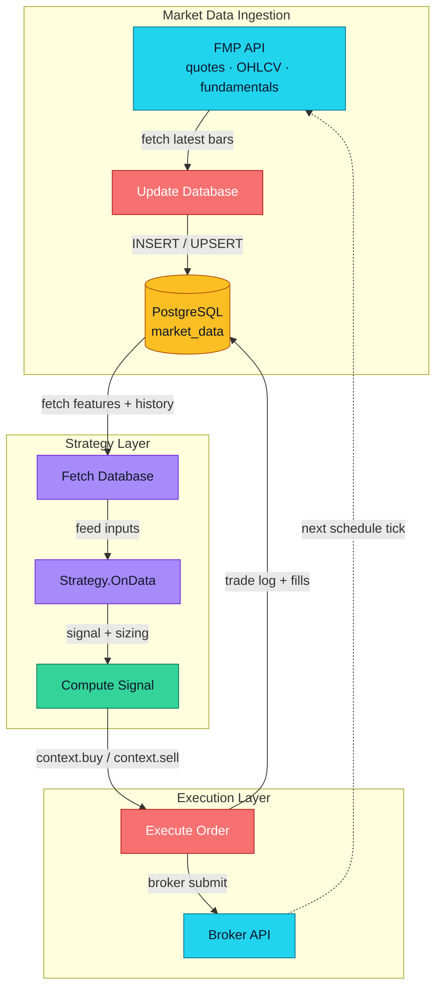

# Live Trading Bot — Workflow

End-to-end loop from market data ingestion to order execution.

## Stages

1. **FMP API** — pull quotes / OHLCV / fundamentals on schedule tick.
2. **Update Database** — ingest, normalize, write to PostgreSQL.
3. **Strategy** — scheduled run loads parameters and pulls features.
4. **Fetch Database** — read latest bars + history needed by the model.
5. **Compute Signal** — model + rules produce target position and sizing.
6. **Execute Order** — submit via broker API, log fills back to DB.

Loop repeats on next schedule tick.
