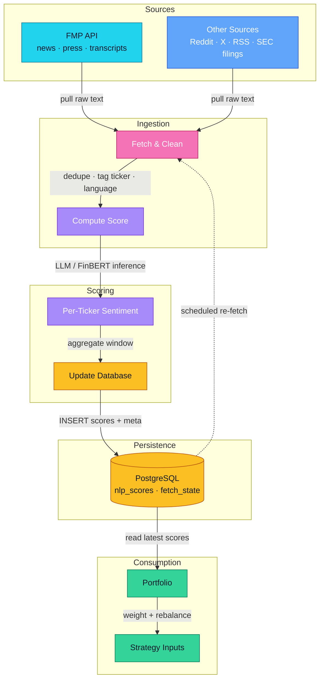

# NLP Pipeline — Workflow

Multi-source text ingestion → sentiment scoring → database → portfolio consumption.

## Stages

1. **Sources** — FMP API for news/press/transcripts, plus Reddit, X, RSS, SEC filings.
2. **Fetch & Clean** — dedupe, normalize, tag tickers and language.
3. **Compute Score** — LLM / FinBERT inference produces per-ticker sentiment.
4. **Update Database** — write scores and state snapshots to PostgreSQL.
5. **Portfolio** — reads latest scores, applies weighting and rebalance rules.
6. **Strategy Inputs** — sentiment feeds downstream strategies.

Scheduled re-fetch closes the loop.
